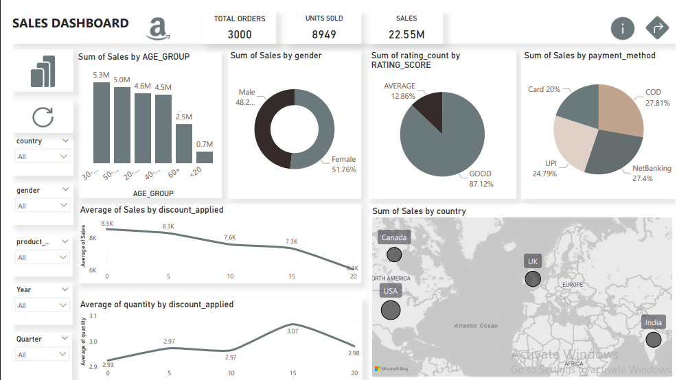
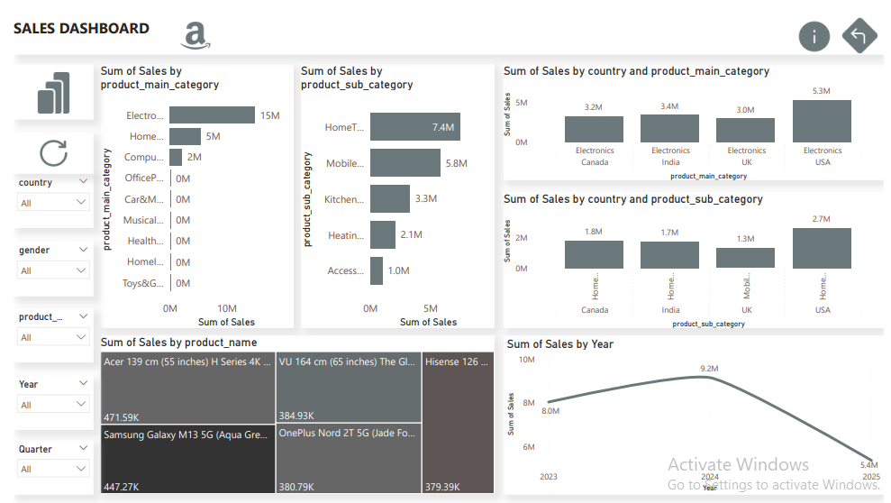

# AMAZON-SALES-ANALYSIS-POWER-BI-DASHBOARD
POWER BI DASHBOARD
Project Overview
This project analyzes an Amazon sales dataset containing product details, customer details, location details, sales details  
The main objectives are:  

- Explore sales distribution across categories, subcategories, and payment methods 
-  Generate meaningful insights on customer preferences, pricing patterns, and sales performance.
- Provide visualizations to communicate trends effectively. 
## Dashboard Preview

## Download PDFs
[Customer Insights PDF](Amazon_Sales_Analysis_Part1_Customer_Insights.pdf)  
[Product Performance PDF](Amazon_Sales_Analysis_Part2_Product_Performance.pdf)

## View Live Dashboard
You can explore the interactive dashboard on Power bi Web here:  
[View on Power bi Web](https://app.powerbi.com/view?r=eyJrIjoiMzgwNmM3Y2YtYjYxNS00ZDMwLThhNTQtZmVlNWFlMzY5NTRlIiwidCI6IjBhOWI3YWFkLTc0MDEtNDdlYi04OTUwLTU2NTk3NDQwMzViOSJ9)

Key Findings
Top Categories: Electronics and Home & Kitchen dominate overall sales.
Top Subcategories: Home Theater/TV and Mobile Accessories are the best-selling subcategories.
Peak Sales 2024: Highest sales reached $9.15M, indicating peak performance.
2025 Trend: Sharp drop in sales compared to 2023 and 2024.
2023 Performance: Started strong with $8.0M in sales.
Category Consistency: Electronics remain the top-selling main category across all countries.
Monthly Peak: Highest sales occur in July.
Top Countries by Sales Volume:
  USA: $8.2M
  UK: $5M
Popular Payment Methods: Cash on Delivery (COD) and Net Banking account for 27.8% of transactions.
Top Customer Age Group: 30-39 years old generate the highest sales ($5.3M).
Discount Impact: Higher discounts slightly increase quantity sold but reduce total revenue.
Gender Influence: Gender does not significantly influence product category choices; sales are almost equal for males and females.
Customer Ratings: Most ratings fall under the “Good” category.
Discounts and Revenue: Products with 0%-5% discounts contribute the maximum sales amount.
